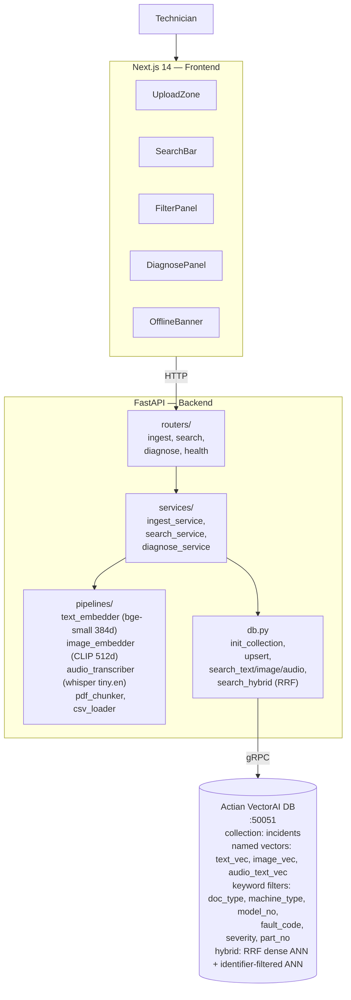
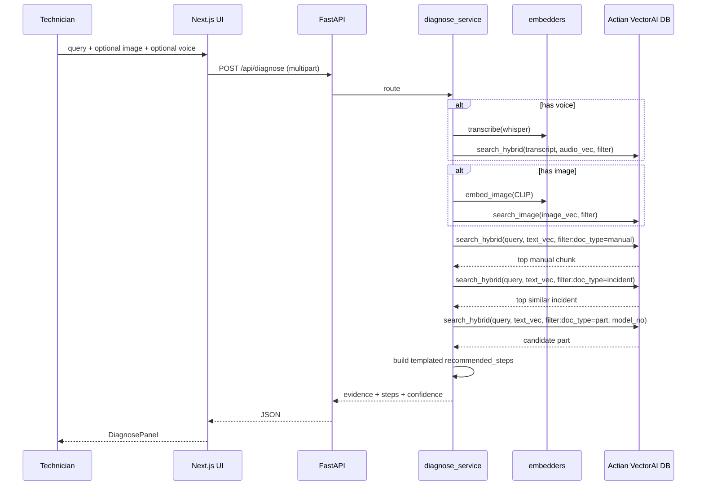

# Architecture

## Flow diagram (Mermaid — rendered on GitHub)



## Request lifecycle — `/api/diagnose`



## Collection schema

```
collection: incidents

  named vectors
  ────────────────────────────────────────────────
    text_vec         384   cosine   Dense text embedding
    image_vec        512   cosine   CLIP image embedding
    audio_text_vec   384   cosine   Dense embedding of whisper transcript

  keyword-indexed metadata
  ────────────────────────────────────────────────
    doc_type         keyword   manual | incident | part | error_code | voice_note
    machine_type     keyword
    model_no         keyword   provided or backfilled from text
    fault_code       keyword   provided or backfilled from text
    severity         keyword   low | medium | high | critical
    part_no          keyword   provided or backfilled from text
    source_id        keyword

  payload fields (not indexed)
  ────────────────────────────────────────────────
    text_content     text      returned as auditable snippet / evidence payload
    created_at       datetime
    page             integer
    chunk_id         integer
    fix_applied      text
    downtime_min     integer
    parts_used       text
    doc_id           text      human-readable id (the point id itself is uuid5(doc_id))
```

## Hybrid fusion detail

```
query: "E04 motor overload"

          ┌────────────────────────────────┐       ┌───────────────────────────────┐
          │ text_vec ANN top-50            │       │ identifier-filtered ANN top-50 │
          │  (bge-small embedding)         │       │  (fault/model/part exact)      │
          └────────────────┬───────────────┘       └──────────────┬────────────────┘
                           │                                      │
                           └──────────────────┬───────────────────┘
                                              ▼
                                    RRF merge (k=60)
                                   score = Σ 1/(60 + rank)
                                              │
                                              ▼
                                        top-k returned
```

Rare tokens like error codes (`E04`) and identifiers like `CX-200` or `OL-E04-R` are promoted through the identifier-filtered branch, while symptom phrases ("motor tripped on overload") are dense-retrievable. RRF covers both without scrolling payloads in Python.

---

## For the Excalidraw handoff

Use the Mermaid diagrams above as the source of truth. In Excalidraw:

1. Import the first mermaid block via "Mermaid to Excalidraw" (Excalidraw has this built-in).
2. Recolor to match slide template if you have one — otherwise the default is fine.
3. Export PNG at 2× for submission.
